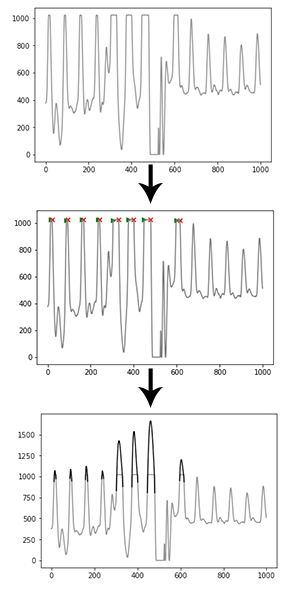
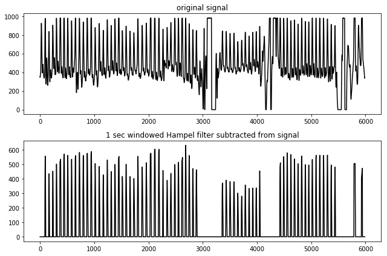
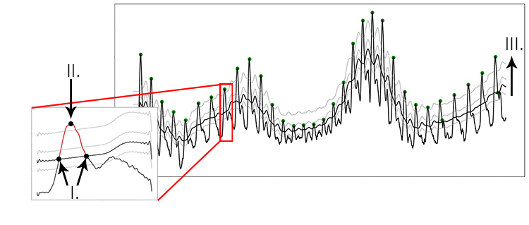
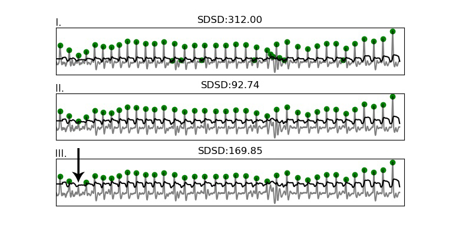
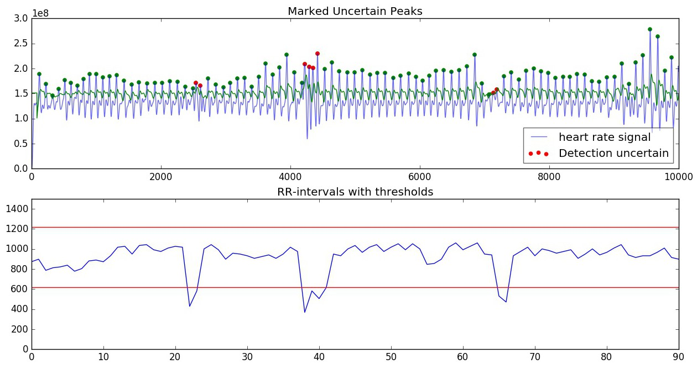

.. _algorithm functioning:

*********************
Algorithm functioning
*********************

This section describes the details of the algorithm functionality. 

Pre-processing
==============
Various options are available for pre-processing. These are described below

Clipping detection and interpolation
~~~~~~~~~~~~~~~~~~~~~~~~~~~~~~~~~~~~
Whenever a measured property exceeds a sensor's sensitivity range, or when digitising an analog signal, clipping can occur. Clipping in this case means the peaks are flattened off because the signal continues outside the boundaries of the sensor you're using:

.. image:: images/clipping.jpg
   :height: 300px
   :width: 300px
   :align: center
   
Clipping functions by detecting (almost) flat parts of the signal near its maximum, preceded and followed by a steep angle on both ends. The 'missing' signal peak is interpolated using a cubic spline, which takes into account 100ms of data on both ends of the clipping portion of the signal. The reconstructed R-peak is overlaid on the original signal and used for further analysis.

Peak enhancement
~~~~~~~~~~~~~~~~
A peak enhancement function is available that attempts to normalise the amplitude, then increase R-peak amplitude relative to the rest of the signal. It only uses linear transformations, meaning absolute peak positions are not disturbed (in contrast to FIR filters). It runs a predefined number of iterations. Generally two iterations are sufficient. Be cautious not to over-iterate as this will start to suppress peaks of interest as well.

.. code-block:: python

    import heartpy as hp
    
    enhanced = hp.enhance_peaks(data, iterations=2)

.. image:: images/peaknorm.jpeg
        

Butterworth filter
~~~~~~~~~~~~~~~~~~
A Butterworth filter implementation is available to remove high frequency noise. Note that this will disturb the absolute peak positions slightly, influencing the output measures. However, in cases of heavy noise this is the only way useful information can be extracted from the signal.

.. code-block:: python
    
    import heartpy as hp
    
    filtered = hp.butter_lowpass_filter(data, cutoff=5, sample_rate=100.0, order=3)
    
.. image:: images/butterworth.jpeg

Filtering is generally not recommended unless there is high noise present in the signal. An extreme example is displayed below:

.. image:: images/highnoise.png

Hampel Correction
~~~~~~~~~~~~~~~~~
The Hampel Correction functions as an extended version of a Hampel Filter, with a larger window size than the standard datapoint + 3 datapoints on each side (=7). The downside is that it (the current implementation at least) takes significant processing time since a window median and median absolute deviation needs to be computed for each datapoint.

In the current implementation, if called, a median filter is taken over a 1-sec window of the heart rate signal. The filter output is subsequently subtracted from the original signal. When doing so, the property of noise suppression arises:

Note that the absolute peak positions will shift slightly when using this type of filter. With it, the output measures will start to deviate as error is induced. Generally the error is not high, but by default hampel filtering is disabled. It should only be used when encountering segments of heavy noise that the algorithm cannot handle properly.

Peak detection
==============
The peak detection phase attempts to accommodate amplitude variation and morphology changes of the PPG complexes by using an adaptive peak detection threshold (Fig 3, III), followed by several steps of outlier detection and rejection. To identify heartbeats, a moving average is calculated using a window of 0.75 seconds on both sides of each data point. The first and last 0.75 seconds of the signal are populated with the signal’s mean, no moving average is generated for these sections. Regions of interest (ROI) are marked between two points of intersection where the signal amplitude is larger than the moving average (Fig 3, I-II), which is a standard way of detecting peaks. R-peaks are marked at the maximum of each ROI.

*Figure showing the process of peak extraction. A moving average is used as an intersection threshold (II). Candidate peaks are marked at the maximum between intersections (III). The moving average is adjusted stepwise to compensate for varying PPG waveform morphology (I).*

During the peak detection phase, the algorithm adjusts the amplitude of the calculated threshold stepwise. To find the best fit, the standard deviation between successive differences (SDSD, see also 2.2) is minimised and the signal’s BPM is checked. This represents a fast method of approximating the optimal threshold by exploiting the relative regularity of the heart rate signal. As shown in the figure below, missing one R-peak (III.) already leads to a substantial increase in SDSD compared to the optimal fit (II.). Marking incorrect R-peaks also leads to an increase in SDSD (I.). The lowest SDSD value that is not zero, in combination with a likely BPM value, is selected as the best fit. The BPM must lie within a predetermined range (default: 40 <= BPM <= 180, range settable by user).

The figure below displays how the SDSD relates to peak fitting. In essence the fitting function exploits the strong regularity expected in the heart rate signal.

*Figure showing how the SDSD responds strongly even to a single missed beat (bottom plot), and is lowest when all peaks are properly detected (middle plot).*

Whenever clipping occurs, the algorithm detects this and will attempt to reconstruct the waveform by spline interpolation. This is discussed under `Clipping detection and interpolation`_

An optional 'high precision mode' is available that takes the signal surrounding each detected peak (+/- 100ms on both ends), and upsamples it to simulate a higher sampling rate for more accurate peak position estimation. By default it upsamples to 1000Hz to provide ms-accurate peak position estimations.

Peak rejection
==============
After the fitting phase, several incorrectly detected peaks may still remain due to various factors. These are tested and rejected based on a thresholded value for the RR-intervals in the section:

Thresholds are computed based on the mean of the RR-intervals in the segments. Thresholds are determined as **RR_mean +/- (30% of RR_mean, with minimum value of 300)** (+ or - for upper and lower threshold, respectively). If the RR-interval exceeds one of the thresholds, it is ignored.

Calculation of measures
=======================
All measures are computed on the detected and accepted peaks in the segment. When RR-intervals are used in computation, only the intervals created by two adjacent, accepted, peaks are used. Whenever differences in RR-intervals are required (for example in the RMSSD), only intervals between two adjacens RR-intervals, which in turn are created by three adjacent, accepted, peaks are used. This ensures that any rejected peaks do not inject measurement error in the subsequent measure calculations.

Time-series
~~~~~~~~~~~
Time series measurements are computed from detected peaks. The output measures are:

- beats per minute (BPM)
- interbeat interval (IBI)
- standard deviation of RR intervals (SDNN)
- standard deviation of successive differences (SDSD)
- root mean square of successive differences (RMSSD)
- proportion of successive differences above 20ms (pNN20)
- proportion of successive differences above 50ms (pNN50)
- median absolute deviation of RR intervals (MAD)

Frequency Domain
~~~~~~~~~~~~~~~~
Frequency domain measures computed are:

- low-frequency, frequency spectrum between 0.05-0.15Hz (LF)
- high-frequency, frequency spectrum between 0.15-0.5Hz (HF)
- the ration high frequency / low frequency (HF/LF)

The measures are computed from the PSD (Power Spectral Density), which itself is estimated using either FFT-based, Periodogram-based, or Welch-based methods. The default is Welch's method.

Estimating breathing rate
~~~~~~~~~~~~~~~~~~~~~~~~~
One interesting property of the heart is that the frequency with which it beats is strongly influenced by breathing, through the autonomous nervous system. It is one of the reasons why deep breaths can calm nerves. We can also exploit this relationship to extract breathing rate from a segment of heart rate data. For example, using a dataset from [1]_ which contains both CO2 capnometry signals as well as PPG signals, we can see the relationship between breathing and the RR-intervals clearly. Below are plotted the CO2 capnometry signal (breathing signal measured at the nose), as well as the (upsampled) signal created by the RR-intervals:

.. image:: images/CO2_RRbreath.jpg
   :align: center

The problem is now reduced to one of frequency domain transformation. Breathing rate can be extracted using the toolkit. After calling the 'process' function, breathing rate (in Hz) is available in the dict{} object that is returned.

.. code-block:: python

    import heartpy as hp
    
    data = hp.get_data('data.csv')
    fs = 100.0
    working_data, measures = hp.process(data, fs, report_time=True)
    print('breathing rate is: %s Hz' %measures['breathingrate'])
    
This will result in:

.. code-block:: python
    
    breathing rate is: 0.16109544905356424 Hz
    

References
==========

.. [1] W. Karlen, S. Raman, J. M. Ansermino, and G. A. Dumont, “Multiparameter respiratory rate estimation from the photoplethysmogram,” IEEE transactions on bio-medical engineering, vol. 60, no. 7, pp. 1946–53, 2013. DOI: 10.1109/TBME.2013.2246160 PMED: http://www.ncbi.nlm.nih.gov/pubmed/23399950