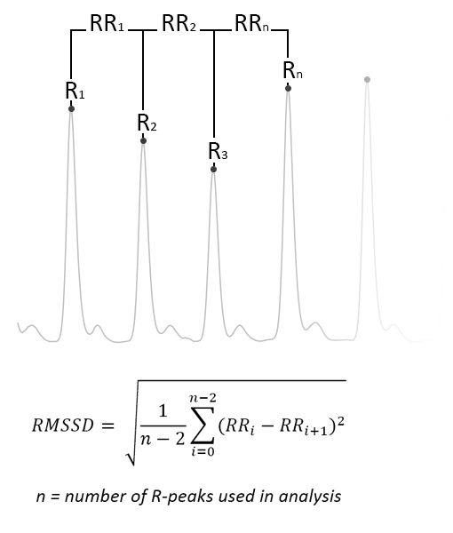
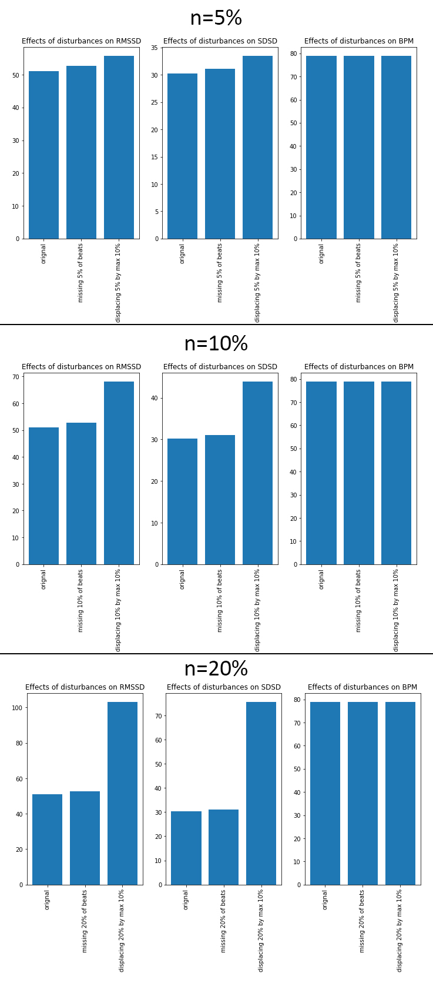

.. _heart rate analysis:

*******************
Heart Rate Analysis
*******************

A complete description of the algorithm can be found in: <ref embedded paper>.

Background
==========

The Python Heart Rate Analysis Toolkit has been designed mainly with PPG signals in mind. The Raspberry Pi and the Arduino platforms have enabled more diverse data collection methods by providing affordable open hardware platforms. This is great for researchers, especially because traditional ECG may be considered to invasive or too disruptive for experiments. 

Measuring the heart rate signal
===============================

Two often used ways of measuring the heart rate are the electrocardiogram (ECG) and the Photoplethysmogram (PPG). Many of the online available algorithms are designed for ECG measurements. Applying an ECG algorithm (like the famous Pan-Tompkins one [1]_) to PPG data does not necessarily make sense. Although both the ECG and PPG are measures for cardiac activity, they measure very different constructs to estimate it.

The ECG measures the electrical activations that lead to the contraction of the heart muscle, using electrodes attached to the body, usually at the chest. The PPG uses a small optical sensor in conjunction with a light source to measure the discoloration of the skin as blood perfuses through it after each heartbeat. This measuring of electrical activation and pressure waves respectively, leads to very different signal and noise properties, that require specialised tools to process. This toolkit specialises in PPG data.

|

.. image:: images/ppg_ecg.jpg

*Figure 1: a. and b. display the ECG and PPG waveform morphology, respectively. The ECG is divided into distinct waves (a, I-V), of which the R-wave (a, II) is used for heart beat extraction. With the PPG wave, the systolic peak (b, I) is used. The plot in c. shows the relationship between ECG and PPG signals.*

Most notably in the ECG is the QRS-complex (Fig 1a, I-III), which represents the electrical activation that leads to the ventricles contracting and expelling blood from the heart muscle. The R-peak is the point of largest amplitude in the signal. When extracting heart beats, these peaks are marked in the ECG. Advantages of the ECG are that it provides a good signal/noise ratio, and the R-peak that is of interest generally has a large amplitude compared to the surrounding data points (Fig 1c). The main disadvantage is that the measurement of the ECG is invasive. It requires the attachment of wired electrodes to the chest of the participant, which can interfere with experimental tasks such as driving.

The PPG measures the discoloration of the skin as blood perfuses through the capillaries and arteries after each heartbeat. The signal consists of the systolic peak (Fig 1-b, I), dicrotic notch (II), and the diastolic peak (III). When extracting heart beats, the systolic peaks (I) are used. PPG sensors offer a less invasive way of measuring heart rate data, which is one of their main advantages. Usually the sensors are placed at the fingertip, earlobe, or on the wrist using a bracelet. Contactless camera-based systems have recently been demonstrated [2]_, [3]_, [4]_. These offer non-intrusive ways of acquiring the PPG signal. PPG signals have the disadvantages of showing more noise, large amplitude variations, and the morphology of the peaks displays broader variation (Figure 2b, c). This complicates analysis of the signal, especially when using software designed for ECG, which the available open source tools generally are.

.. image:: images/ECG_PPG_Comparison.jpg

*Figure 2 – The ECG signal (a.) shows a strong QRS complex together with little amplitude variation. The PPG signal measured simultaneously while the patient is at rest in a hospital bed (b.) shows some amplitude variation but relatively stable morphology. When measuring PPG in a driving simulator using low-cost sensors (c.), strong amplitude and waveform morphology variation is visible.*

|

On the Accuracy of Peak Position
================================
When analysing heart rate, the main crux lies in the accuracy of the peak position labeling being used. When extracting instantaneous heart rate (BPM), accurate peak placement is not crucial. The BPM is an aggregate measure, which is calculated as the average beat-beat interval across the entire analysed signal (segment). This makes it quite robust to outliers. 

However, when extracting heart rate variability (HRV) measures, the peak positions are crucial. Take as an example two often used variability measures, the RMSSD (root mean square of successive differences) and the SDSD (standard deviation of successive differences). Given a segment of heart rate data as displayed in the figure below, the RMSSD is calculated as shown. The SDSD is the standard deviation between successive differences.

*Figure 3 - Image displaying the desired peak detection result, as well as the calculation of the RMSSD measure. The SDSD measure is the standard deviation between successive differences*

|

Now consider that two mistakes are possible: either a beat is not detected at all (missed), or a beat is placed at an incorrect time position (incorrectly placed). These will have an effect on the calculated HRV output measures, which are highly sensitive to outliers as they are designed to capture the slight natural variation between peak-peak intervals in the heart rate signal!

To illustrate the problem we have run a few simulations. We took a sample of a heart rate signal which was annotated manually, and introduced two types of errors:

- We randomly dropped n% of peaks from the signal, than re-ran the analysis considering only intervals between two peaks where no missing value occurred in between.
- We introduced a random position error (0.1% - 10% of peak position, meaning between about 1ms and 100ms deviation) in n% of peaks.
- The simulation ran bootstrapped for 10,000 iterations, with values n=[5, 10, 20].

Results show that the effect of incorrect beat placements **far outweigh** those of missing values. As described earlier, the instantaneous heart rate (BPM) is not sensitive to outliers, as is shown in the plots as well, where almost no discernible deviation is visible.

    
*Figure 4 - Results for manually anotated measures (ground truth), and error induction of n% missed beats, as well as error induction on the detected position of n% beats (random error 0.1% - 10%, or 1-100ms).*

Take into consideration that the scale for RMSSD doesn't typically exceed +/- 130, SDSD doesn't differ by much. This means that even a few incorrectly detected peaks are already introducing large measurement errors into the output variables. The algorithm described here is specifically designed to handle noisy PPG data from cheap sensors. The main design criteria was to minimise the number of incorrectly placed peaks as to minimise the error introduced into the output measures.

More information on the functioning can be found in the rest of the documentation, as well as in the technical paper here [6]_. Information on the valiation can be found in [5]_.

References
==========

.. [1] Pan, J., & Tompkins, W. J. A simple real-time QRS detection algorithm. IEEE TRANSACTIONS ON BIOMEDICAL ENGINEERING, BME-32(3), 230–236, 1985. https://doi.org/10.1109/IEMBS.1996.647473

.. [2] Y. Sun, S. Hu, V. Azorin-Peris, R. Kalawsky, and S. Greenwald, “Noncontact imaging photoplethysmography to effectively access pulse rate variability,” J. Biomed. Opt., vol. 18, no. 6, p. 61205, 2012.

.. [3] M. Lewandowska, J. Ruminsky, T. Kocejko, and J. Nowak, “Measuring Pulse Rate with a Webcam - a Non-contact Method for Evaluating Cardiac Activity,” in Proceedings of the Federated Conference on Computer Science and Information Systems, 2011, no. January, pp. 405–410.

.. [4] F. Bousefsaf, C. Maaoui, and  a. Pruski, “Remote detection of mental workload changes using cardiac parameters assessed with a low-cost webcam,” Comput. Biol. Med., vol. 53, pp. 1–10, 2014.

.. [5] van Gent, P., Farah, H., van Nes, N., & van Arem, B. (2018). “Heart Rate Analysis for Human Factors: Development and Validation of an Open Source Toolkit for Noisy Naturalistic Heart Rate Data.“ In proceedings of the Humanist 2018 conference, 2018, pp.173-17

.. [6] van Gent, P., Farah, H., van Nes, N., & van Arem, B. (2018). Analysing Noisy Driver Physiology Real-Time Using Off-the-Shelf Sensors: Heart rate analysis software from the Taking the Fast Lane Project. http://doi.org/10.13140/RG.2.2.24895.56485

