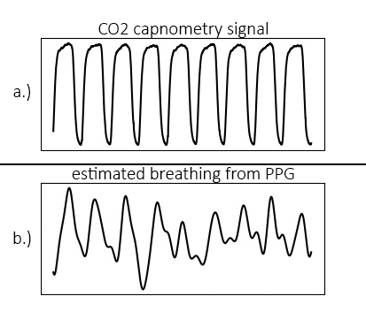

.. _heart rate analysis:

*******************
Heart Rate Analysis
*******************

A complete description of the algorithm can be found in: <ref embedded paper>.

Background
==========

The Python Heart Rate Analysis Toolkit has been designed mainly with PPG signals in mind. The Raspberry Pi and the Arduino platforms have enabled more diverse data collection methods by providing affordable open hardware platforms. This is great for researchers, especially because traditional ECG may be considered to invasive or too disruptive for experiments. 

Measuring the heart rate signal
~~~~~~~~~~~~~~~~~~~~~~~~~~~~~~~

Two often used ways of measuring the heart rate are the electrocardiogram (ECG) and the Photoplethysmogram (PPG). Many of the online available algorithms are designed for ECG measurements. Applying an ECG algorithm (like the famous Pan-Tompkins one [1]_) to PPG data does not necessarily make sense. Although both the ECG and PPG are measures for cardiac activity, they measure very different constructs to estimate it.

The ECG measures the electrical activations that lead to the contraction of the heart muscle, using electrodes attached to the body, usually at the chest. The PPG uses a small optical sensor in conjunction with a light source to measure the discoloration of the skin as blood perfuses through it after each heartbeat.

|

.. image:: images/ppg_ecg.jpg

*Figure 1: a. and b. display the ECG and PPG waveform morphology, respectively. The ECG is divided into distinct waves (a, I-V), of which the R-wave (a, II) is used for heart beat extraction. With the PPG wave, the systolic peak (b, I) is used. The plot in c. shows the relationship between ECG and PPG signals.*

Most notably in the ECG is the QRS-complex (Fig 1a, I-III), which represents the electrical activation that leads to the ventricles contracting and expelling blood from the heart muscle. The R-peak is the point of largest amplitude in the signal. When extracting heart beats, these peaks are marked in the ECG. Advantages of the ECG are that it provides a good signal/noise ratio, and the R-peak that is of interest generally has a large amplitude compared to the surrounding data points (Fig 1c). The main disadvantage is that the measurement of the ECG is invasive. It requires the attachment of wired electrodes to the chest of the participant, which can interfere with experimental tasks such as driving.

The PPG measures the discoloration of the skin as blood perfuses through the capillaries and arteries after each heartbeat. The signal consists of the systolic peak (Fig 1-b, I), dicrotic notch (II), and the diastolic peak (III). When extracting heart beats, the systolic peaks (I) are used. PPG sensors offer a less invasive way of measuring heart rate data, which is one of their main advantages. Usually the sensors are placed at the fingertip, earlobe, or on the wrist using a bracelet. Contactless camera-based systems have recently been demonstrated [2]_, [3]_, [4]_. These offer non-intrusive ways of acquiring the PPG signal. PPG signals have the disadvantages of showing more noise, large amplitude variations, and the morphology of the peaks displays broader variation (Figure 2b, c). This complicates analysis of the signal, especially when using software designed for ECG, which the available open source tools generally are.

.. image:: images/ECG_PPG_Comparison.jpg

*Figure 2 – The ECG signal (a.) shows a strong QRS complex together with little amplitude variation. The PPG signal measured simultaneously while the patient is at rest in a hospital bed (b.) shows some amplitude variation but relatively stable morphology. When measuring PPG in a driving simulator using low-cost sensors (c.), strong amplitude and waveform morphology variation is visible.*

|

Pre-processing
==============
Various options are available for pre-processing.

Outlier detection
~~~~~~~~~~~~~~~~~
peak enhancement and FIR filtering. Outlier detection and rejection is implemented based on a Hampel Filter [20]. 

Clipping detection and interpolation
~~~~~~~~~~~~~~~~~~~~~~~~~~~~~~~~~~~~
Whenever a measured property exceeds a sensor's sensitivity range, or when digitising an analog signal, clipping can occur. Clipping in this case means the peaks are flattened off because the signal continues outside the boundaries of the sensor you're using:

.. image:: images/clipping.jpg
   :height: 300px
   :width: 300px
   :align: center
   
Clipping functions by detecting (almost) flat parts of the signal near its maximum, preceded and followed by a steep angle on both ends.

Peak enhancement
~~~~~~~~~~~~~~~~
A peak enhancement function is available that attempts to normalise the amplitude, then increase R-peak amplitude relative to the rest of the signal. It runs a predefined number of iterations. Generally two iterations are sufficient. Be cautious not to over-iterate as this will start to suppress peaks of interest as well.

.. code-block:: python

    import heartbeat as hb
    
    enhanced = hb.enhance_peaks(data, iterations=2)

.. image:: images/peaknorm.jpeg
        

Butterworth filter
~~~~~~~~~~~~~~~~~~
A Butterworth filter implementation is available to remove high frequency noise. 

.. code-block:: python
    
    import heartbeat as hb
    
    filtered = hb.butter_lowpass_filter(data, cutoff=5, sample_rate=100.0, order=3)
    
.. image:: images/butterworth.jpeg

Peak detection
==============
The peak detection phase attempts to accommodate amplitude variation and morphology changes of the PPG complexes by using an adaptive peak detection threshold (Fig 3, III), followed by several steps of outlier detection and rejection. To identify heartbeats, a moving average is calculated using a window of 0.75 seconds on both sides of each data point. The first and last 0.75 seconds of the signal are populated with the signal’s mean, no moving average is generated for these sections. Regions of interest (ROI) are marked between two points of intersection where the signal amplitude is larger than the moving average (Fig 3, I-II), which is a standard way of detecting peaks. R-peaks are marked at the maximum of each ROI. 

.. image:: images/fitresultsimg.jpg

*Figure 3 - Figure showing the process of peak extraction. A moving average is used as an intersection threshold (II). Candidate peaks are marked at the maximum between intersections (III). The moving average is adjusted stepwise to compensate for varying PPG waveform morphology (I).*

and will attempt to reconstruct the waveform by spline interpolation whenever an R-peak displays clipping. This is discussed under `Clipping detection and interpolation`_

During the peak detection phase, the algorithm adjusts the amplitude of the calculated threshold stepwise. To find the best fit, the standard deviation between successive differences (SDSD, see also 2.2) is minimised and the signal’s BPM is checked. This represents a fast method of approximating the optimal threshold by exploiting the relative regularity of the heart rate signal. As shown in Figure 5, missing one R-peak (III.) already leads to a substantial increase in SDSD compared to the optimal fit (II.). Marking incorrect R-peaks also leads to an increase in SDSD (I.). The lowest SDSD value that is not zero, in combination with a likely BPM value, is selected as the best fit. The BPM must lie within a predetermined range (default: 40 <= BPM <= 180, range settable by user). When analysing segments in sequence from 

Peak rejection
==============

Calculation of measures
=======================

Time-series
~~~~~~~~~~~

Frequency Domain
~~~~~~~~~~~~~~~~

Estimating breathing rate
~~~~~~~~~~~~~~~~~~~~~~~~~
One interesting property of the heart is that the frequency with which it beats is strongly influenced by breathing, through the autonomous nervous system. It is one of the reasons why deep breaths can calm nerves. We can also exploit this relationship to extract breathing rate from a segment of heart rate data. For example, using a dataset from [5]_ which contains both CO2 capnometry signals as well as PPG signals, we can see the relationship between breathing and the RR-intervals clearly. Below are plotted the CO2 capnometry signal (breathing signal measured at the nose), as well as the RR-intervals:

The problem is now reduced to one of peak finding. Breathing rate can be extracted using the toolkit. After calling the 'process' function, breathing rate (in Hz) is available in the models object that is returned.

.. code-block:: python

    import heartbeat as hb
    
    data = hb.get_data('data.csv')
    fs = 100.0
    measures = hb.process(data, fs, report_time=True)
    print('breathing rate is: %s Hz' %measures['breathingrate'])
    
This will result in:

.. code-block:: python
    
    breathing rate is: 0.16109544905356424 Hz
    

References
==========

.. [1] Pan, J., & Tompkins, W. J. A simple real-time QRS detection algorithm. IEEE TRANSACTIONS ON BIOMEDICAL ENGINEERING, BME-32(3), 230–236, 1985. https://doi.org/10.1109/IEMBS.1996.647473

.. [2] Y. Sun, S. Hu, V. Azorin-Peris, R. Kalawsky, and S. Greenwald, “Noncontact imaging photoplethysmography to effectively access pulse rate variability,” J. Biomed. Opt., vol. 18, no. 6, p. 61205, 2012.

.. [3] M. Lewandowska, J. Ruminsky, T. Kocejko, and J. Nowak, “Measuring Pulse Rate with a Webcam - a Non-contact Method for Evaluating Cardiac Activity,” in Proceedings of the Federated Conference on Computer Science and Information Systems, 2011, no. January, pp. 405–410.

.. [4] F. Bousefsaf, C. Maaoui, and  a. Pruski, “Remote detection of mental workload changes using cardiac parameters assessed with a low-cost webcam,” Comput. Biol. Med., vol. 53, pp. 1–10, 2014.

.. [5] W. Karlen, S. Raman, J. M. Ansermino, and G. A. Dumont, “Multiparameter respiratory rate estimation from the photoplethysmogram,” IEEE transactions on bio-medical engineering, vol. 60, no. 7, pp. 1946–53, 2013. DOI: 10.1109/TBME.2013.2246160 PMED: http://www.ncbi.nlm.nih.gov/pubmed/23399950