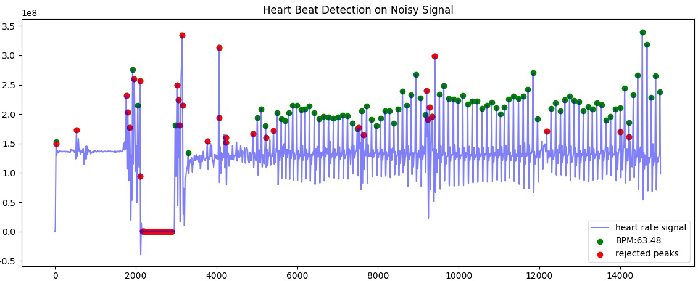

.. _quickstart:

****************
Quickstart Guide
****************

Basic Example
=============
Import the `heartbeat` module and load a file

.. code-block:: python

    import heartbeat as hb

    hrdata = hb.get_data('yourdata.csv', column_name='hr')

This returns a :code:`numpy.ndarray`.

Analysis requires the sampling rate for your data. If you know this *a priori*, supply it when calling the `process()` function, which returns a `dict{}` object containing all measures:

.. code-block:: python

    import heartbeat as hb

    data = hb.get_data('yourdata.csv')
    measures = hb.process(data, 100.0)

:code:`process(dataset, fs, hrw=0.75, report_time=False)` requires two arguments:

* **dataset:** An 1-dimensional list, numpy array or array-like object containing the heart rate data;
* **fs**: The samplerate of the signal in Hz;
* **hrw:** _optional_ `hrw` is the window size used for the calculation of the moving average. The windowsize is defined as `hrw * samplerate`. Default hrw=0.75.
* **report_time:** _optional_ whether to report total processing time of process() loop.

A :code:`dict{}` object is returned containing all measures. The object is also stored in the module. Access as such:

.. code-block:: python

    import heartbeat as hb

    data = hb.get_data('data.csv') 
    fs = 100.0 #example file 'data.csv' is sampled at 100.0 Hz

    measures = hb.process(data, fs, report_time=True)

    print(measures['bpm']) #returns BPM value
    print(measures['rmssd'] # returns RMSSD HRV measure
        
    #Alternatively, use dictionary stored in module:
    print(hb.measures['bpm']) #returns BPM value
    print(hb.measures['sdsd'] # returns SDSD HRV measure

    #You can also use Pandas if you so desire
    import pandas as pd
    df = pd.read_csv("data.csv")
    #note we need calc_fft if we want frequency-domain measures
    measures = hb.process(df['hr'].values, fs, calc_fft=True)
    print("measures['bpm'])
    print("measures['lf/hf'])

    
Getting Data From Files
=======================
The toolkit has functionality to open and parse delimited .csv and .txt files, as well as matlab .mat files. Opening a file is done by the :code:`get_data()` function:

.. code-block:: python

    import heartbeat as hb

    data = hb.get_data('data.csv')

This returns a 1-dimensional :code:`numpy.ndarray` containing the heart rate data.

:code:`get_data(filename, delim = ',', column_name = 'None')` requires one argument:

* **filename:** absolute or relative path to a valid (delimited .csv/.txt or matlab .mat) file;
* **delim** _optional_: when loading a delimited .csv or .txt file, this specifies the delimiter used. Default delim = ',';
* **column_name** _optional_: In delimited files with header: specifying column_name will return data from that column. Not specifying column_name for delimited files will assume the file contains only numerical data, returning np.nan values where data is not numerical. For matlab files: column_name specifies the table name in the matlab file.

Examples:

.. code-block:: python

    import heartbeat as hb

    #load data from a delimited file without header info
    headerless_data = hb.get_data('data.csv')

    #load data from column labeles 'hr' in a delimited file with header info
    headered_data = hb.get_data('data.csv', column_name = 'hr')

    #load matlab file
    matlabdata = hb.get_data('data2.mat', column_name = 'hr')
    #note that the column_name here represents the table name in the matlab file
        

Estimating Sample Rate
======================
The toolkit has a simple built-in sample-rate detection. It can handle ms-based timers and datetime-based timers.

.. code-block:: python

    import heartbeat as hb

    #if you have a ms-based timer:
    fs = hb.get_samplerate_mstimer(mstimer_data)

    #if you have a datetime-based timer:
    fs = hb.get_samplerate_datetime(datetime_data, timeformat='%Y-%m-%d %H:%M:%S.%f')

:code:`get_samplerate_mstimer(timerdata)` requires one argument:

* **timerdata:** a list, numpy array or array-like object containing ms-based timestamps (float or int).

:code:`get_samplerate_datetime(datetimedata, timeformat = '%H:%M:%S.f')` requires one argument:

* **datetimedata:** a list, numpy array or array-like object containing datetime-based timestamps (string);
* **timeformat** _optional_: the format of the datetime-strings in your dataset. Default timeformat='%H:%M:%S.f', 24-hour based time including ms: 21:43:12.569.

Plotting Results
================
A plotting function is included. It plots the original signal and overlays the detected peaks and the rejected peaks (if any were rejected). 

Example with the included `data.csv` example file (recorded at 100.0Hz):

.. code-block:: python

    import heartbeat as hb

    data = hb.get_data('data.csv')
    measures = hb.process(data, 100.0)
    hb.plotter()

This returns:

.. image:: images/output1.jpeg

:code:`plotter(show = True, title = 'Heart Rate Signal Peak Detection')` has two optional arguments:

* **show** _optional_: if set to True a plot is visualised, if set to False a matplotlib.pyplot object is returned. Default show = True;
* **title** _optional_: Sets the title of the plot. If not specified, default title is used.

Examples:
~~~~~~~~~

.. code-block:: python

    import heartbeat as hb
    hrdata = hb.get_data('data2.csv', column_name='hr')
    timerdata = hb.get_data('data2.csv., column_name='timer')

    hb.process(dataset, hb.get_samplerate_mstimer(timerdata))

    #plot with different title
    hb.plotter(title='Heart Beat Detection on Noisy Signal')

Measures are only calculated for non-rejected peaks and intervals between two non-rejected peaks. Rejected detections do not influence the calculated measures.

By default a plot is visualised when plotter() is called. The function returns a matplotlib.pyplot object if the argument show=False is passed:

.. code-block:: python

    hb.process(dataset, 0.75, get_samplerate_mstimer(dataset))
    hb.plotter(show=False)

This returns:

.. code-block:: python

    <module 'matplotlib.pyplot' [...]>

Object can then be saved or visualised:

.. code-block:: python

    hb.process(dataset, 0.75, get_samplerate_mstimer(dataset))
    plot_object = hb.plotter(show=False)

    plot_object.savefig('plot_1.jpg') #saves the plot as JPEG image.

    plt.object.show() #displays plot 
      